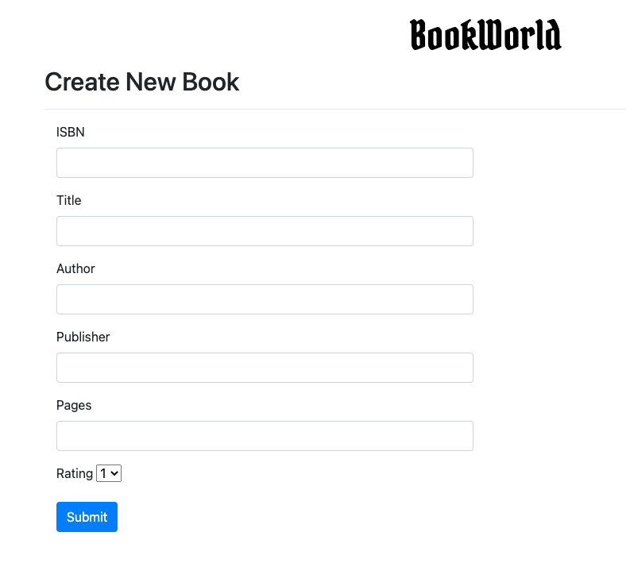
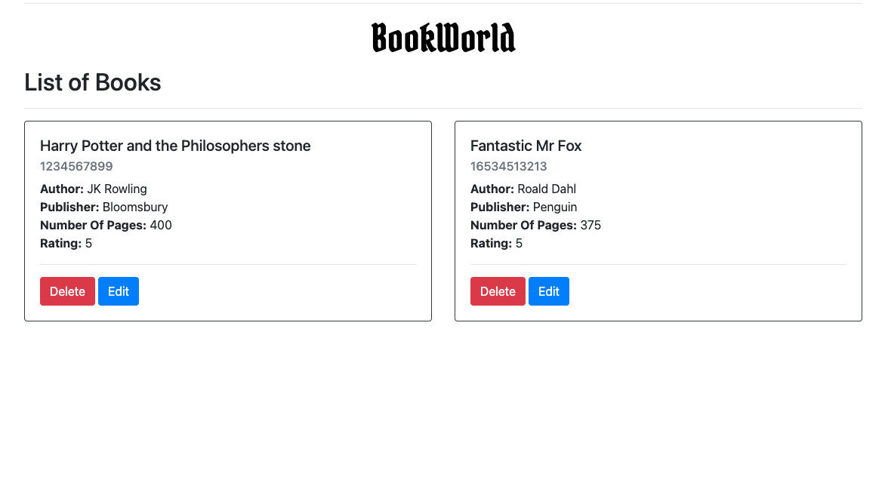

<h1 align="center">

Bookshelf

</h1>

## Objective
A full stack application for books with CRUD functionality connected to postgreSQL cloud database.

## Progress
- Homepage created
- Entry page created
- Bootstrap installed for CSS
- Cloud database connected 
- List page created
- Books can now be added into database
- Books are displayed in JSON format in list page
- Individual books can be selected from url
- Individual books can now be deleted by ISBN
- Individual books can now be updated by ISBN
- Individual books can be searched for in homepage
- Books now listed as bootstrap cards
- Alert box now appears if ISBN searched is less than 10 char
- Search results are now displayed as cards
- Conditional statement added if no results are found
- Cards can be edited and deleted 

## Improvements
- Formatting
- File structure

## Testing

## Installation
- Clone repository
- `npm install`

To Run
- `node index`

## Screenshots

Homepage

Add a book

Books are listed as Bootstrap cards

## Tech Stack
HTML, CSS, Bootstrap, Javascript, NodeJS, Express, ElephantSQL

## Collaborators
mattybwoy